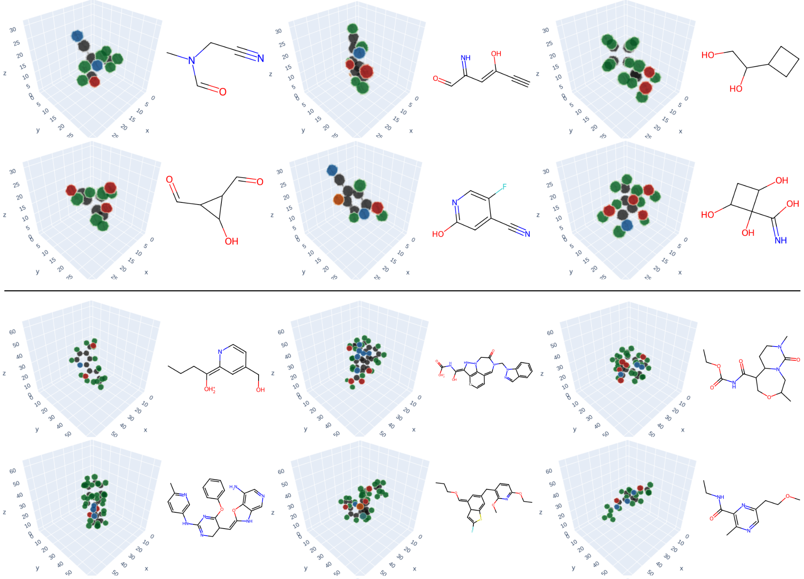

# VoxMol: 3D molecule generation by denoising voxel grids
This repository contain the implementation of the paper [3D molecule generation by denoising voxel grids](https://arxiv.org/abs/2306.07473):
```
@inproceedings{pinheiro2023voxmol,
  title={3D molecule generation by denoising voxel grids},
  author={Pinheiro, Pedro O and Rackers, Joshua and Kleinhenz, Joseph and Maser, Michael and Mahmood, Omar and Watkins, Andrew Martin and Ra, Stephen and Sresht, Vishnu and Saremi, Saeed},
  booktitle={NeurIPS},
  year={2023}
}
```
**Voxmol** is a generative model that operates on _voxelized molecules_ and follows the _neural empirical Bayes_ framework to generate molecules. The figure below shows an example of a "walk-jump sampling" chain generating different valid molecules.


Below we show a few generated samples from a model trained on QM9 (top) and GEOM-drugs (bottom).



## Workflow
We assume the user have anaconda (or mamba, preferably) installed and has access to GPU.

### 1. Install the environment
Install the VoxMol env and code:
```bash
mamba env create -f env.yaml
conda activate vox_mol
pip install -e .
```
### 2. Prepare data
To preprocess the QM9 data, run:
```bash
cd voxmol/dataset; python create_data_qm9.py
```

And to preprocess the GEOM-drugs data, run:
```bash
cd voxmol/dataset; python create_data_geom_drugs.py
```

These two scripts will preprocess the QM9 and the GEOM-drugs dataset (it will take dozens of minutes to process the GEOM-drugs dataset). We use the split on the official [MiDi's implementation](https://github.com/cvignac/MiDi).

### 3. Train VoxMol
To train VoxMol on QM9/GEOM-drugs, run in `voxmol/` dir:
```bash
python train_wjs.py --dset_name [qm9|drugs] --batch_size [128|64]
```
Use the flag `--wandb 1` if you want to log results on
wandb. The model and training log will be saved in a directory that looks like `voxmol/exps/exp_qm9_sig0.9_lr2e-05`. See `options.py` to see all the argument options.

This script will train a denoising autoencoder on the train set, evaluate denoising performance on val set at each epoch. Then, at each 20 epochs, it will generate 1k samples.

The QM9 model was trained with batch size of 128 (on 2 GPUs) for 500 epochs. The GEOM-drugs model was trained with batch size 64 (on 4 GPUs) for 24M iterations.

### 4. Generating samples with a pretrained VoxMol
To generate molecules, run the following command in `voxmol/`:
```python
python sample_wjs.py --pretrained_path PATH_TO_PRETRAINED_MODEL/
```
`PATH_TO_PRETRAINED_MODEL` is the path where the pretrained model was saved on the step above. This file will generate 100 molecules and save them as independent `.xyz` files. See the args in `sample_wjs.py` for different sampling hyperparameters.

## License
This project is under the Apache license, version 2.0. See LICENSE for details.
